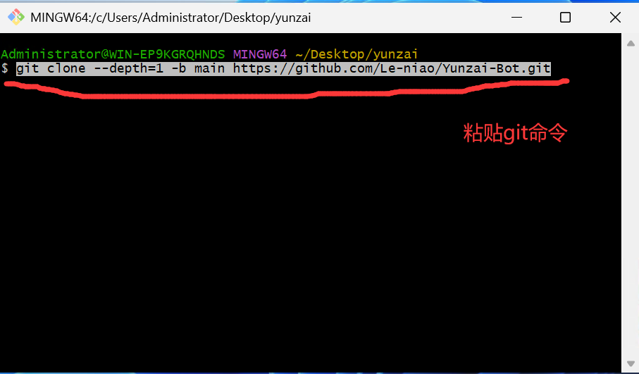
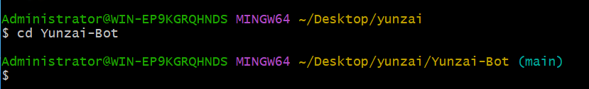
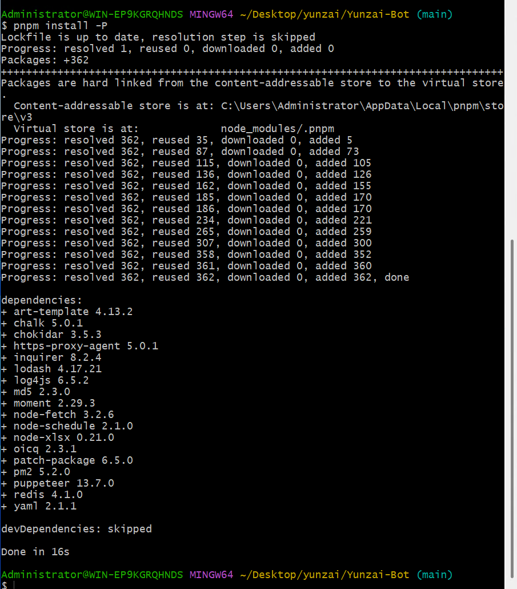
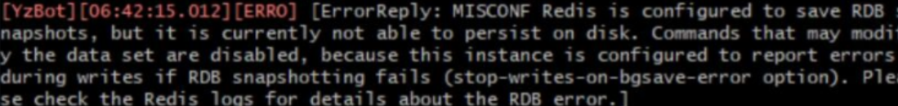

# Yunzai-Bot指南

## 简介

- Yunzai-Bot是原神qq群机器人，通过米游社接口，查询原神游戏信息，快速生成图片返回，
- 此指南是教你如何安装Yunzai-Bot和它的插件，编写插件和一些问题的解决方法。
- 注：本指南暂未完善，欢迎大家提交Issues和Pull Requests
- 点个star，谢谢

## Yunzai-Bot

### 安装Yunzai-Bot

#### Windows:

- 环境准备:[Node.js][nodejs](建议版本v16.18.0),[redis][redis],[git][git]
1. 新建一个文件夹，命名随便，最好别用中文

2. 右键文件夹，选择git bash here


3. 克隆项目
命令
```
git clone --depth=1 -b main https://github.com/Le-niao/Yunzai-Bot.git
```


- 这样就算成功


2. 进入Yunzai目录

```
cd Yunzai-Bot 
```


3. 安装pnpm，已安装的可以跳过
```bash
npm install pnpm -g
```
- （因为我已经安装过了，所以就不放图了）

4. 安装依赖
```bash
pnpm install -P
```


5. 运行（首次运行按提示输入登录）
```
node app
```


#### 安卓termux
等更新。。。。。

#### Linux

建议使用大佬的脚本

### 基础操作

- 启动云崽： `node app`

- 查看日志： `npm run log`

- 关闭云崽： 对着机器人发送 `#关机`，或者在关掉云崽运行窗口

- 功能列表： `#帮助`

- 更新云崽： `#全部更新`,`#强制更新`，`#更新`,`git pull`

- 重置云崽的部分设置(QQ 号，主人 QQ 等)： `npm run login`

---

### 目录说明

| 目录                     | 说明                           |
| ------------------------ | ------------------------------ |
| config\config\qq.yaml    | 可以修改登录方式，QQ 号        |
| config\config\redis.yaml | redis的设置（非必要别修改）        |
| config\config\other.yaml | 可以修改主人 QQ                |
| data\face                | 存放添加表情的位置             |
| data\MysCookie           | 存放 cookie 的位置             |
| logs\                    | 存放日志文件的位置              |
| plugins\example          | 存放 js 插件的位置             |
| Yunzai-Bot\plugins       | 存放大型插件的位置，如喵喵插件 |

### 插件安装教程

- 注：均为V3插件

#### [锅巴插件](https://gitee.com/guoba-yunzai/guoba-plugin) 
- 主要提供云崽的网页端后台管理界面功能
- 安装教程：
- 第 1 步：下载插件

- 在云崽根目录下打开终端，运行

```
git clone --depth=1 https://gitee.com/guoba-yunzai/guoba-plugin.git ./plugins/Guoba-Plugin/
```

- 第 2 步：安装依赖

- 方式1：采用 pnpm

> 注：如果你不是通过`pnpm`安装的云崽，那么请【**不要**】使用此方式，请看`方式2`

如果你是使用`pnpm`安装的云崽，那么只需要在云崽根目录下运行此命令即可：

```bash
pnpm install --filter=guoba-plugin
```

> 注：请务必直接复制提供的命令，否则可能会导致依赖丢失的情况，若发生需自行重新安装。<br>
> `--filter=guoba-plugin`：只安装`guoba-plugin`下的依赖，其他依赖不处理，防止丢失。

- 方式2：采用 npm 或 cnpm

如果是使用`npm`或`cnpm`等其他依赖安装工具，需要手动安装以下依赖：

```bash
npm install express multer body-parser jsonwebtoken
```

如果以上命令执行失败，可尝试使用`cnpm`进行安装，只需将开头的`npm`替换成`cnpm`即可。

> 注：cnpm需要单独安装，已安装的可以忽略，安装命令如下：<br>
> `npm install cnpm -g --registry=https://registry.npmmirror.com`

- 第 3 步：运行插件

依赖安装完毕之后，直接运行即可，默认运行端口号是：50831

> 可在 config/application.yaml 中修改

启动完成之后，可以在控制台中看到网页地址，复制到浏览器中即可访问。

如果访问不到，请发送`#锅巴帮助`指令获取帮助。

#### [喵喵插件 (miao-plugin)](https://gitee.com/yoimiya-kokomi/miao-plugin)
- Miao-Plugin是一个Yunzai-Bot的升级插件，提供包括角色查询等升级功能。
- 具体功能可在安装插件后 通过 #喵喵帮助 进行查看。如需进行设置可通过 #喵喵设置 命令进行管理。
---
- 安装与更新
请将miao-plugin放置在Yunzai-Bot的plugins目录下，重启Yunzai-Bot后即可使用。
推荐使用git进行安装，以方便后续升级。在Yunzai根目录夹打开终端，运行
-  使用gitee
```
git clone https://gitee.com/yoimiya-kokomi/miao-plugin.git ./plugins/miao-plugin/
```
-  使用github
```
git clone https://github.com/yoimiya-kokomi/miao-plugin.git ./plugins/miao-plugin/
```
进行安装。建议使用上述命令进行安装，以便于后续更新。 管理员发送`#喵喵更新`即可自动更新

#### [抽卡插件 (flower-plugin)](https://gitee.com/Nwflower/flower-plugin)
- flower-plugin是一个适用于V3版本Yunzai-Bot的原神图鉴插件包，主要提供拓展抽卡功能，意在不修改本体抽卡卡池信息的情况下提供自定义卡池的拓展

1. 使用github源获取插件

2. 在Yunzai-Bot根目录下，运行cmd，输入以下指令

```
git clone --depth=1 https://github.com/Nwflower/flower-plugin.git ./plugins/flower-plugin/
```
- 如果运行失败，可以使用gitee镜像源，指令如下
```
git clone --depth=1 https://gitee.com/Nwflower/flower-plugin.git ./plugins/flower-plugin/
```


#### py插件

- 我个人的建议是：
- 别去费精力装了
- 直接装个nonebot不好吗
- 换个登录端口直接实现1号俩机器人

#### [单个js格式插件通用安装方法](https://gitee.com/yhArcadia/Yunzai-Bot-plugins-index?_from=gitee_search#js%E6%8F%92%E4%BB%B6%E7%B4%A2%E5%BC%95)

- 超级简单，只要把插件下载好后放入 `Yunzai-bot/plugins/example` 里即可 


### 常用链接
>下载链接（均为网盘）有密码的均为114514

- redis下载链接:[☞redis][redis]
- git下载链接:[☞git][git]
- node.js下载链接:[☞node.js][nodejs]
- python3.8下载链接[☞python3.8][python]
- ffmpeg下载链接[☞ffmpeg][ffmpeg]
- 滑块验证助手下载链接[☞滑块验证][滑块验证]

>你一定用的上的地址

- 官方文档地址:[☞Yunzai-Bot][Yunzai-Bot]
- Yunzai-Bot插件库：[☞Github](https://github.com/yhArcadia/Yunzai-Bot-plugins-index)/[☞Gitee](https://gitee.com/yhArcadia/Yunzai-Bot-plugins-index)
- Yunzai-Bot（V3）：[☞Github](https://github.com/Le-niao/Yunzai-Bot)/[☞Gitee](https://gitee.com/Le-niao/Yunzai-Bot) 
- Yunzai-Bot（V2）：[☞Github](https://github.com/yoimiya-kokomi/Yunzai-Bot)/[☞Gitee](https://gitee.com/yoimiya-kokomi/Yunzai-Bot) 

### 问题解答
- cookie 绑定失败？

  - 先把云崽 `#强制更新` 一下 
  - 然后重新获取cookie

- 装完 node 但是还是提示 `npm:command not found`

  - 请自行百度搜索 `Windows环境变量设置`
  - 在用户环境变量的 Path 变量中点击编辑，添加 `C:\Program Files\nodejs` 与 `C:\Users\把这段中文替换成你自己的用户名\AppData\Roaming\npm` 字段
  - 重启电脑即可食用

- 签到显示 `验证码失败` ?

  - 太正常不过，这个问题无解，有解决方法的请私发我

- 提示 `qq版本过低` ？

  -  <br>此图来源于喵喵插件群
  - 亲测有效

- 提示 `请配置公共ck` ？

  - 字面意思，`#配置公共ck`把你的ck发给机器人
  - 或者`#使用全部ck`

- 公共 ck 查询次数已用完，暂无法查询新 uid？

  - 不用慌，再绑定一个就是了
  - 或者 `#使用全部ck`

-  <br> MISCONF Redis is configured to save RDB
  snapshots

  - 控制面板->系统和安全->系统->高级系统设置->高级选项卡下方第一个卡片“性能”里的设置按钮->高级选项卡->虚拟内存->更改->勾选最上方自动管理所有驱动器的分页文件大小->重启电脑

- 机器人进群自动退了怎么办

  - 锅巴插件->配置管理->其它->退群人数改成 0 就行

- 如何删除插件?

  - 在 `Yunzai-bot/plugins` 文件夹里找到对应的插件右键删除即可，
  - 注：如果是插件包需要把整个文件夹都删掉

- 如何关闭入群欢迎?

  - 在 `Yunzai-bot/plugins/example` 文件夹里找到入群欢迎插件，右键删除

- 机器人被冻结了，怎么办？

  - 号封了而已，没啥好办法，能解封就解不能解可以多备几个小号。关闭私聊，减少冻结频率。

- xx 功能报错，xx 功能异常？机器人打不开? 机器人坏了?
  - 重装吧兄弟
  - 也可以不重装：重置云崽步骤(数据会保留)：在云崽根目录下打开 git bash 输入`git pull`，然后再`git reset --hard origin/main`，最后再手动重启即可解决。

- 喵喵插件的 `#xx照片` `xx图片` 功能用不了？

 把 `Yunzai-Bot/plugins/miao-plugin/resources` 的 `character-img` 文件复制一份到 `Yunzai-Bot/plugins/miao-plugin/resources/miao-res-plus` 里就好了

- 机器人群聊消息发不出去，但是私聊正常？

  - 这是触发了 QQ 新版群聊风控，私聊机器人发送 <https://accounts.qq.com/safe/message/unlock?lock_info=5_5> 然后拿出你的手机，并登录机器人的手机 QQ，从机器人的手机 QQ 里打开个链接，验证就行了。

- 十连次数怎么修改？

  - [锅巴插件]里可以配置

- 服务器推荐？

  - 平时服务器都会比较贵，只有新用户和购物节会特别便宜，所以大家各凭本事吧，反正只要服务器能联网就能搭这个机器人。
  - 推荐腾讯云新人特惠50一年2h2G

- 插件除了这些还有别的吗
  - 更多的插件都在云崽官方群里，但是官方群它不对外开放...

## Yunzai-Bot插件教学

- 推荐使用vccode编写[☞下载][vccode]
 
### 单个的js插件

- 先新建一个文件，命名为Helloworld.js
- <u>命名可以改的，最好别用中文，改命名时要记得把下面的类名改了(大小写得一样)</u>

#### 输出Hello，world！

- 代码示例

```javascript
//引入Yunzai插件功能
import plugin from '../../../../../lib/plugins/plugin.js'

//导出  类  类名===文件名 继承  插件类  
export class Helloworld extends plugin {
    constructor() {
        super({
            //后端信息
            name: 'Helloworld',//插件名字，可以随便写
            dsc: 'Helloworld',//插件介绍，可以随便写
            event: 'message',//这个直接复制即可，别乱改
            priority: 250,//执行优先级：数值越低越6
            rule: [
                {
                    //正则:也就是触发指令
                    reg: '^#你好$',
                    //函数:触发上面指令后调用的函数
                    fnc: 'Helloworld'
                }
            ]
        });
    };

    //函数
    async Helloworld(e) {
        e.reply("Hello, world!");//输出Hello，world！
        //阻止消息不再往下
        return;
    };
};
```

#### reply函数的多种用法
1. 直接发送内容
```javascript
    //发送内容:
    e.reply("Hello, world!");
```

2. 是否引用回复
```javascript
//是否引用回复:
e.reply("Hello, world!", true);//false为否，true为是
```

3. 群聊是否撤回消息
```javascript
//群聊是否撤回消息:
e.reply("Hello, world!", false, { recallMsg: 5 });//最大120，0则不处理
```

4. 是否at用户:
```javascript
//是否at用户:
e.reply("Hello, world!", false, { recallMsg: 0 }, true);//false为否，true为是
```

#### 如何使用回复组件

- 代码示例

```javascript
//引入Yunzai插件功能
import plugin from '../../../../../lib/plugins/plugin.js'

//导出  类  类名:要与文件名一致 继承  插件类  
export class Helloworld extends plugin {
    constructor() {
        super({
            //后端信息
            name: 'Helloworld',//插件名字，可以随便写
            dsc: 'Helloworld',//插件介绍，可以随便写
            event: 'message',//这个直接复制即可，别乱改
            priority: 250,//执行优先级：数值越低越6
            rule: [
                {
                    //正则:也就是触发指令
                    reg: '^#你干嘛诶哟$',
                    //函数:触发上面指令后调用的函数
                    fnc: 'Helloworld'
                }
            ]
        });
    };

    //函数
    async Helloworld(e) {
        /** 设置上下文，后续接收到内容会执行hei方法 */
        this.setContext('hei');
        //发送消息
        e.reply("1+1=?");
    }

    //回复函数
    async hei(e) {
        //获取消息
        let xiaoxi = e.message;
        //判断消息
        if (xiaoxi == 3) {
            //回复
            e.reply("回答正确")
            //结束上下文
            this.finish('hei')
        }
        else {
            e.reply("回答错误")
            //再次使用执行hei方法 
            this.setContext('hei')
        }
    }
};
```
#### 各式的判断
正在编写中

### 交流群
|  群名  |      群号     |
|--------|--------------|
|[Yunzai-Bot交流群][qq]|160219343|


[qq]: https://qm.qq.com/cgi-bin/qm/qr?k=-EEMzVPAhafx6-NRzQDZ5yWQ5L_Y17ZA&jump_from=webapi&authKey=znJSNIZ+A5Ignodz5gTX0fTEqxOGfNqn5+RQke35LZQHyXBizlKbn4n4pXwuieXk
[Yunzai]: https://github.com/Le-niao/Yunzai-Bot
[Yunzai-Bot]: https://docs.yunzai.org/
[redis]: https://wwrl.lanzouw.com/iB1f70hizgxa
[git]: https://wwrl.lanzouw.com/iBjDY0hizgre
[nodejs]: http://nodejs.cn/download/
[vccode]: https://code.visualstudio.com/
[plugins]: https://gitee.com/yhArcadia/Yunzai-Bot-plugins-index
[python]: https://wwrl.lanzouw.com/iK7uS0ixl0fi
[ffmpeg]: https://wwrl.lanzouw.com/
[滑块验证]: https://maupdate.rainchan.win/txcaptcha.apk