# Yunzai-Bot指南

## 简介

[](https://gitee.com/lin-zhi-xuan/eihei)
- Yunzai-Bot是原神qq群机器人，通过米游社接口，查询原神游戏信息，快速生成图片返回，
- 此指南是教你如何安装Yunzai-Bot和它的插件，编写插件和一些问题的解决方法。
- 本指南暂未完善，欢迎大家提交Issues和Pull Requests
- 求个star，谢谢
- 我的博客:https://qianxinwanjiu.com/yunzai-bot-zhibei/
- 我的仓库:https://gitee.com/lin-zhi-xuan/eihei

## 安装Yunzai-Bot

### Windows:

- 学不会怎么办，V我50我手把手教你

- 环境准备:[Node.js][nodejs](建议版本v16.18.0),[redis][redis],[git][git]

####  安装git

- 下载地址[git][git],密码:114514


- 一直点next

#### 安装redis

- 下载地址[redis][redis],密码:114514

- 解压后启动redis-server.exe

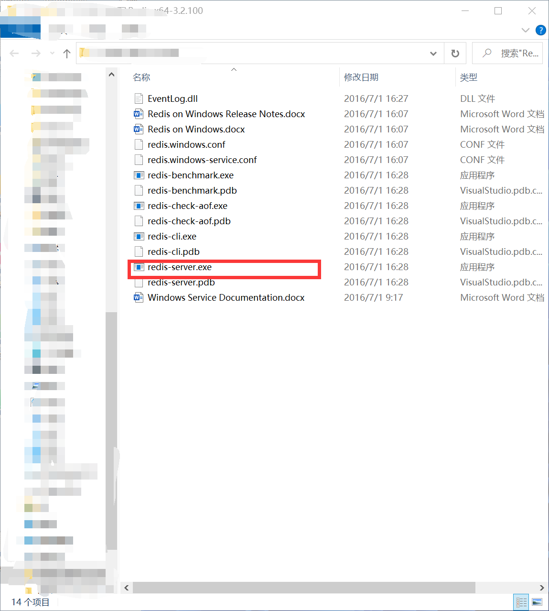

#### 安装Yunzai-Bot本体

1. 新建一个文件夹(也可以不建)，命名随便，最好别用中文

2. 选个拉取方式:

**使用git-bash**

- 1.1 右键文件夹，选择git bash here

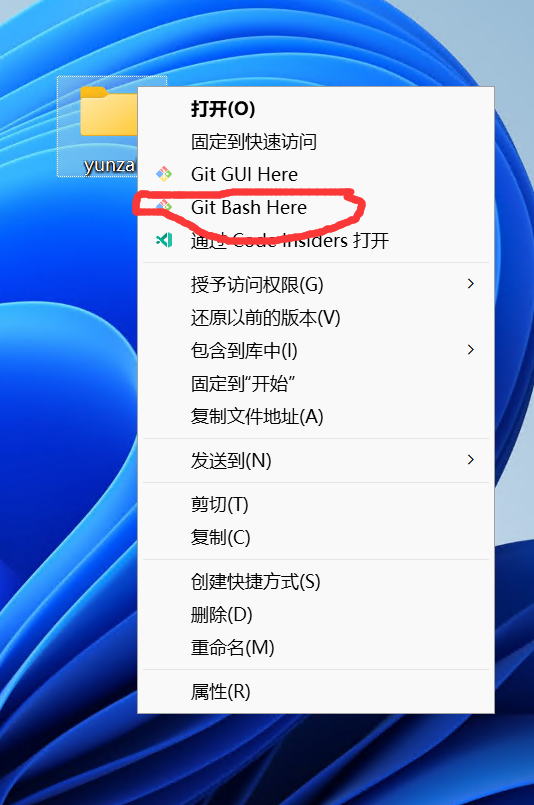

**使用原生自带终端**

- 2.1 进入你要安装Yunzai的文件夹

- 2.2 打开终端(在文件夹路径处将文件家路径改为cmd或者powershell)

3. 克隆项目
命令

```bash
git clone --depth=1 -b main https://gitee.com/Le-niao/Yunzai-Bot.git
```

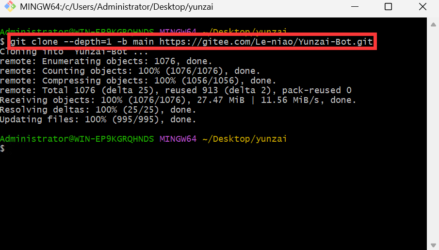

4. 进入Yunzai目录

```bash
cd Yunzai-Bot 
```


5. 安装pnpm，已安装的可以跳过

```bash
npm install pnpm -g
```

- （因为我已经安装过了，所以就不放图了）

- 这里会发生的一些问题：
    输完卡住不动了怎么办？或者提示 `npm ERR！`？或者其他的报错？
    原因：你的服务器太逊了(网络太差了)，根本下载不动，没问题才怪了。
    解决方案：换源，执行命令来更换淘宝镜像源 `npm config set registry http://registry.npm.taobao.org` 然后再次执行安装 pnpm 的命令 `npm install pnpm -g`  
    就是可能有点后遗症，更换镜像源后有微小概率导致后续安装出现问题

6. 安装依赖

```bash
pnpm install -P
```

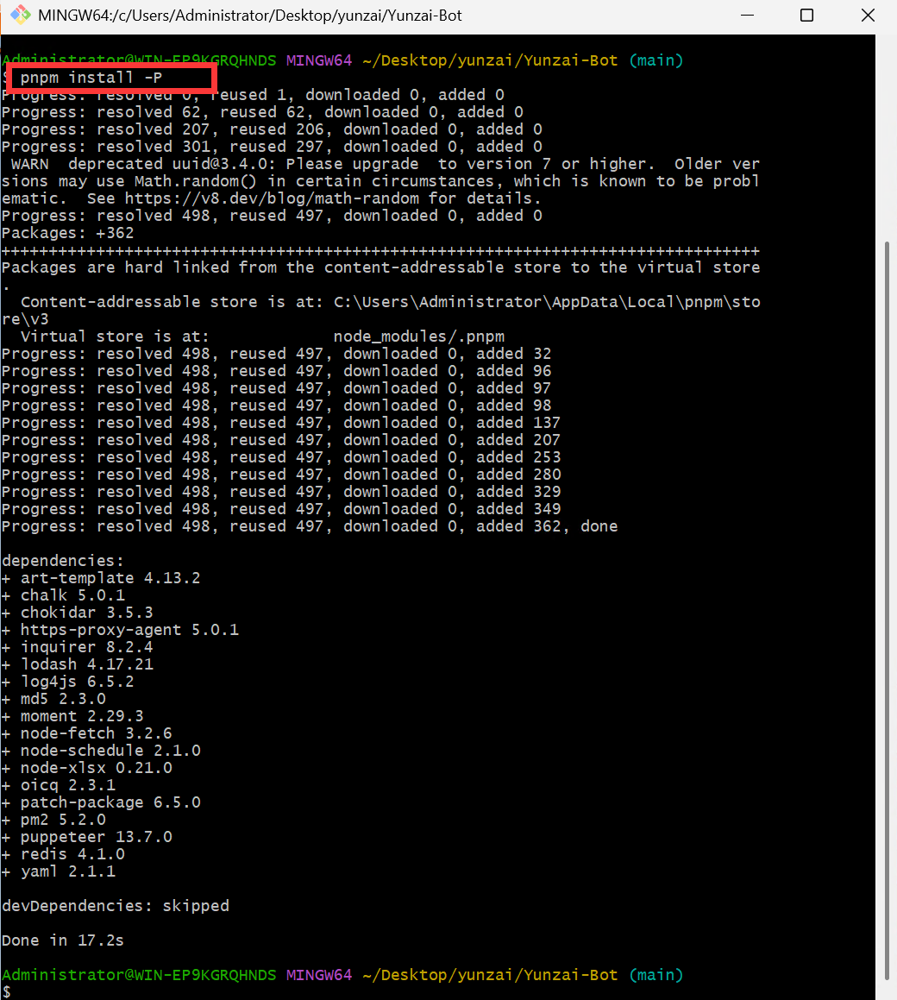

7. 运行（首次运行按提示输入登录）

```bash
node app
```

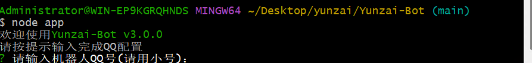

- 如果觉得麻烦，可使用脚本：

>新建一个文件,把后缀改成bat,然后点击编辑

```bat
start "" "C:/redis/redis-server.exe"
cd C:/Yunzai-Bot
node app
pause
```

- 第一行中，第一个双引号无需填写，第二个双引号填写你redis路径
- 第二行填写你Yunzai-Bot根目录

### Linux

#### Ubuntu教程

- 本教程博客地址:https://qianxinwanjiu.com/yunzai-bot-linux-ubuntu/

- 小白不建议使用Linux部署！
- 不建议使用一键脚本！(除非你太废)

>本文的环境：
>纯净的Ubuntu（版本20.04）

1. 安装宝塔面板

- 为什么要安装宝塔面板？
- 因为便于管理文件（更改配置文件、上传面板图等）

>使用以下命令安装：

```bash
wget -O install.sh https://download.bt.cn/install/install-ubuntu_6.0.sh && sudo bash install.sh ed8484bec
```

>安装完成后，记得保存输出的面板地址和账号密码

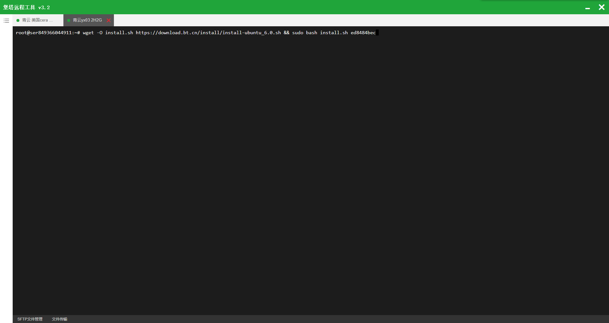


2. 安装Nodejs与redis

- 打开面板地址，绑定手机号（如果你没有账号，请前往https://bt.cn/register.html注册）

- 登陆成功后，会显示一键安装页面，叉掉即可（不需要，因为不建站）

- 然后打开软件商店，搜索nodejs，找到nodejs版本管理器，

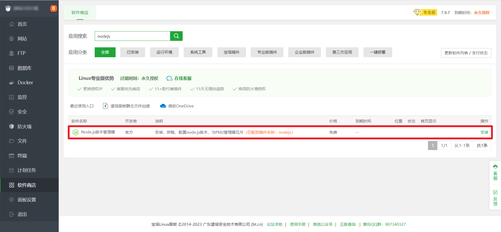

- 点击安装

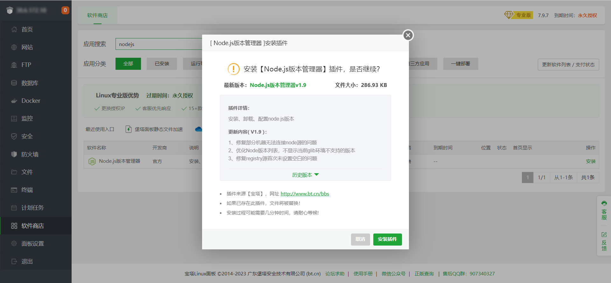


- 点击安装即可

- 然后来到此界面，按下图所示操作

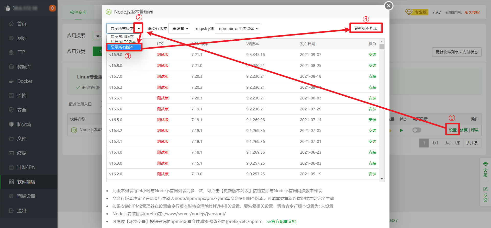

- 建议使用v16.18.0

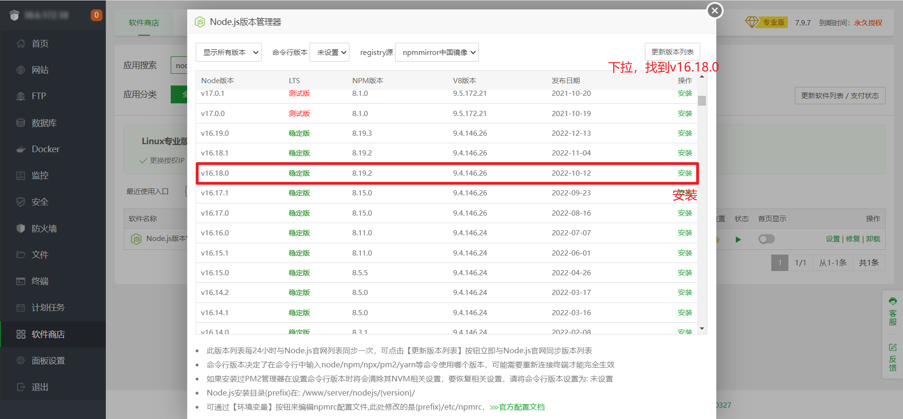

- 安装好后，点击右侧的模块管理，来到下图所示界面，按图操作


- 安装完成，回到软件商店，搜索redis，按下图操作

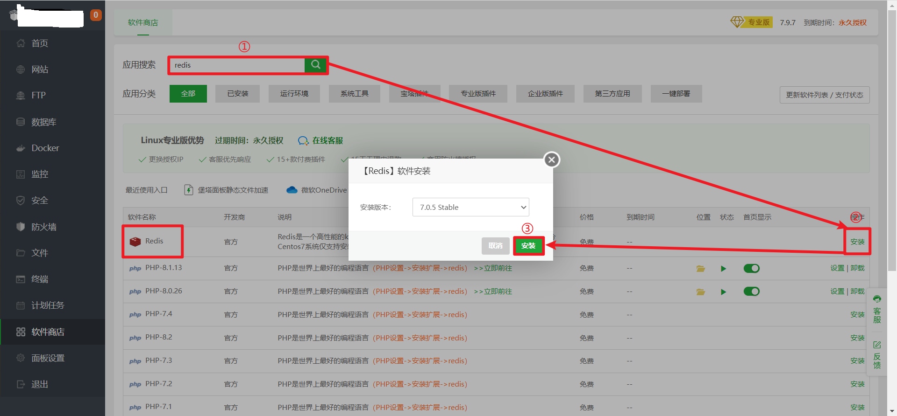

3. 安装Yunzai
- 回到SSH终端，安装GIT，以便拉取仓库

- 执行以下命令：

```bash
sudo apt-get install git
```

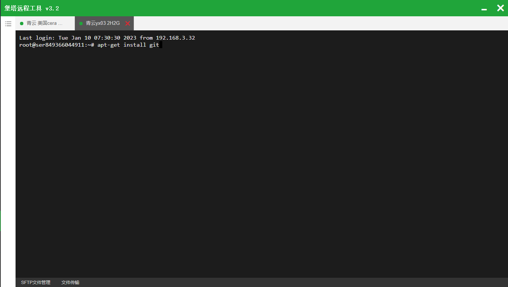

- 等待执行完成

- 然后拉取Yunzai，使用以下命令：

```bash
git clone --depth=1 -b main https://gitee.com/Le-niao/Yunzai-Bot.git
```

- 大致输出以下内容（没有ERR或error就不用管）

```log
Cloning into 'Yunzai-Bot'...
remote: Enumerating objects: 1073, done.
remote: Counting objects: 100% (1073/1073), done.
remote: Compressing objects: 100% (1053/1053), done.
remote: Total 1073 (delta 25), reused 911 (delta 2), pack-reused 0Receiving objects: 100% (1073/1073), 18.37 MiB | 9.07 MiB/s
Receiving objects: 100% (1073/1073), 27.20 MiB | 11.79 MiB/s, done.
Resolving deltas: 100% (25/25), done.
Updating files: 100% (992/992), done.
```

- 然后cd进Yunzai根目录

```bash
cd Yunzai-Bot
```

- pnpm安装过了，所以直接执行

```bash
pnpm install -P
```

输出大致如下

```log
 WARN  deprecated uuid@3.4.0: Please upgrade  to version 7 or higher.  Older versions may use Math.random() in certain circumstances, which is known to be problematic.  See https://v8.dev/blog/math-random for details.
Packages: +362
+++++++++++++++++++++++++++++++++++++++++++++++++++++++++++++++++++++++++++++++++++++++++++++++++++++++++++++++++++++++++++++++++++++++++++++++++
Packages are hard linked from the content-addressable store to the virtual store.
  Content-addressable store is at: /root/.local/share/pnpm/store/v3
  Virtual store is at:             node_modules/.pnpm
Progress: resolved 498, reused 497, downloaded 0, added 362, done

dependencies:
+ art-template 4.13.2
+ chalk 5.0.1
+ chokidar 3.5.3
+ https-proxy-agent 5.0.1
+ inquirer 8.2.4
+ lodash 4.17.21
+ log4js 6.5.2
+ md5 2.3.0
+ moment 2.29.3
+ node-fetch 3.2.6
+ node-schedule 2.1.0
+ node-xlsx 0.21.0
+ oicq 2.3.1
+ patch-package 6.5.0
+ pm2 5.2.0
+ puppeteer 13.7.0
+ redis 4.1.0
+ yaml 2.1.1

devDependencies: skipped

Done in 13.5s
```

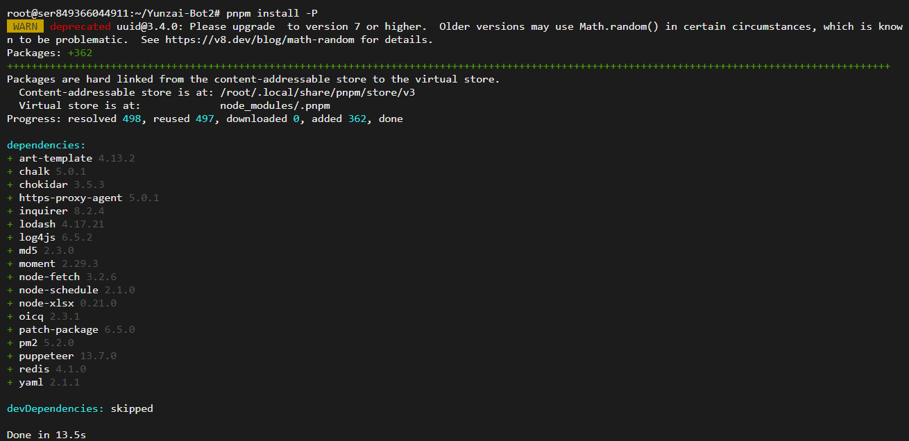

- 记住！WARN不要惊慌，看到ERR或者error才是你需要解决的

- 然后node app启动机器人，按提示操作即可

#### CentOS教程:

- 本教程地址:https://qianxinwanjiu.com/yunzai-linux-centos/#comment-29
- 前提条件
- 首先，请确保你的环境完全干净，不支持已部署项目的机器（易翻车）

- 本文示例系统：CentOS 7.9.2111

- 开始安装
- 安装Nodejs
- 先安装dnf

```bash
yum install -y dnf
```

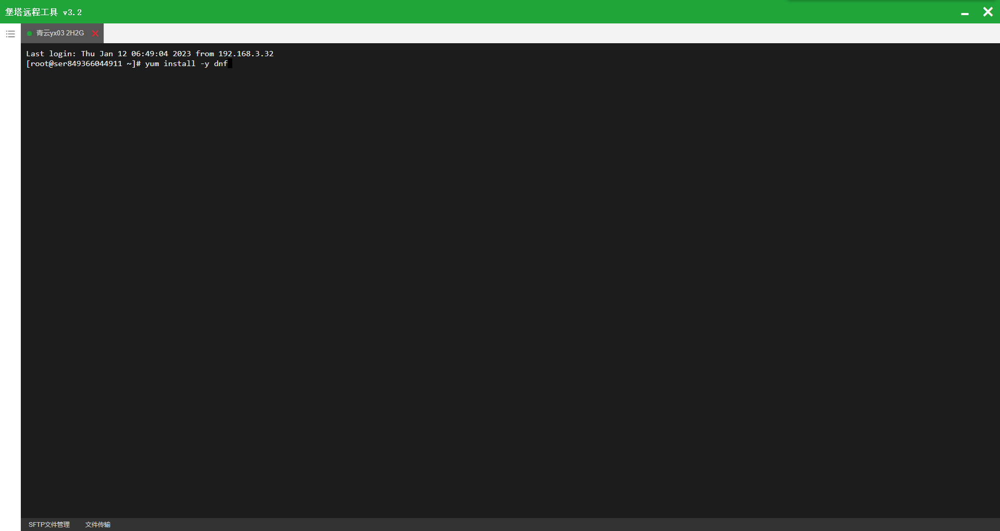

- 使用dnf安装fedora的epel-release插件

```bash
dnf install epel-release
```

- 将存储库加到系统中

```bash
curl -fsSL https://rpm.nodesource.com/setup_16.x | sudo bash -
```

- 安装nodejs，推荐大版本号16

```bash
dnf module install nodejs:16 -y
```

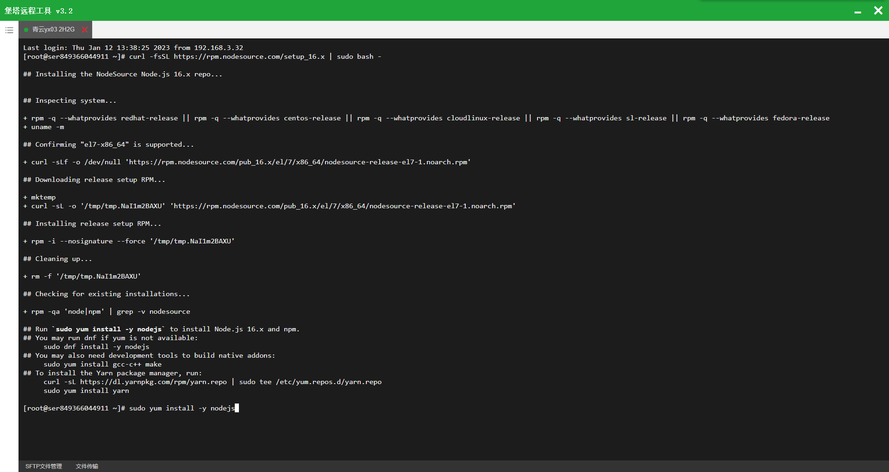

- 然后测试是否正确安装

```bash
node -v
```

- 输出以下即为成功安装

```log
[root@CentOS7.9.2111 ~]# node -v
v16.19.0
```

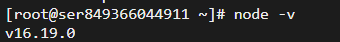

- 安装redis
- 使用以下命令安装并启动redis

```bash
yum -y install redis && redis-server --daemonize yes
```

- 如果像下图一样报错，那么是你没安装epel，返回上文查看命令

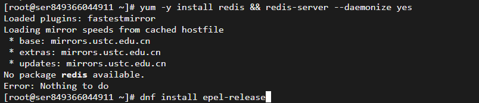

- 安装GIT

```bash
dnf install git -y
```

- 克隆仓库
- 使用以下命令克隆仓库

- 国内服务器（Gitee源）

```bash
git clone --depth=1 -b main https://gitee.com/Le-niao/Yunzai-Bot.git
```

- 国外服务器（GitHub源）

```bash
git clone --depth=1 -b main https://github.com/Le-niao/Yunzai-Bot.git
```

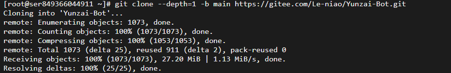

- 安装依赖
- cd进Yunzai根目录（别告诉我你不会cd）

```bash
cd Yunzai-Bot
```

- 然后安装pnpm(-g表示全局)

```bash
npm install pnpm -g
```

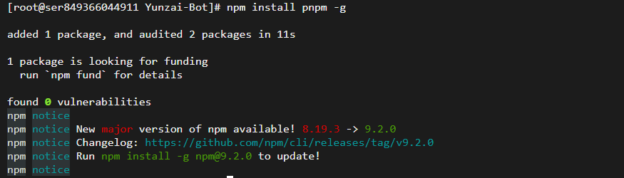

- 用pnpm安装依赖

```bash
pnpm install -P
```

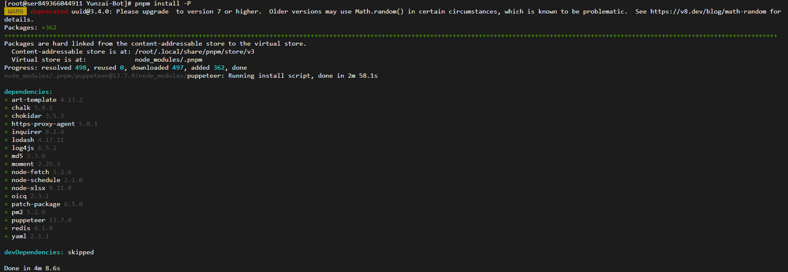

- 还需要安装Chrome依赖库

```bash
yum install pango.x86_64 libXcomposite.x86_64 libXcursor.x86_64 libXdamage.x86_64 libXext.x86_64 libXi.x86_64 libXtst.x86_64 cups-libs.x86_64 libXScrnSaver.x86_64 libXrandr.x86_64 GConf2.x86_64 alsa-lib.x86_64 atk.x86_64 gtk3.x86_64 -y && yum install libdrm libgbm libxshmfence -y && yum install nss -y && yum update nss -y
```

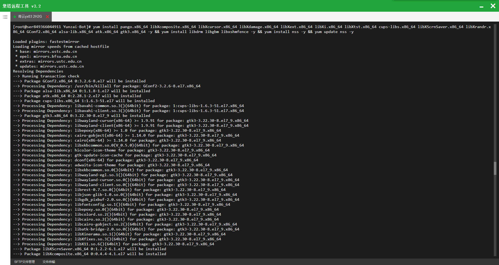

- 安装中文字体，顺便把系统语言切换为中文

```bash
yum groupinstall fonts -y
```

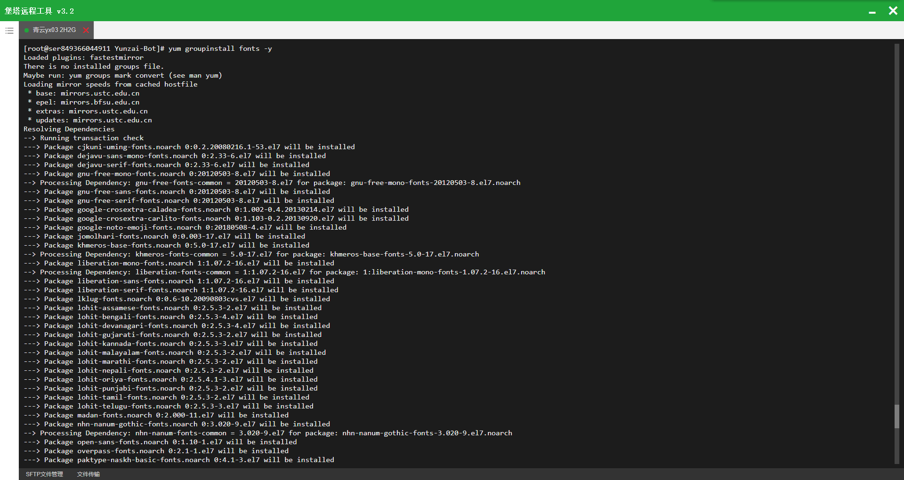

- 然后查看当前系统所有语言包

```bash
locale -a
```

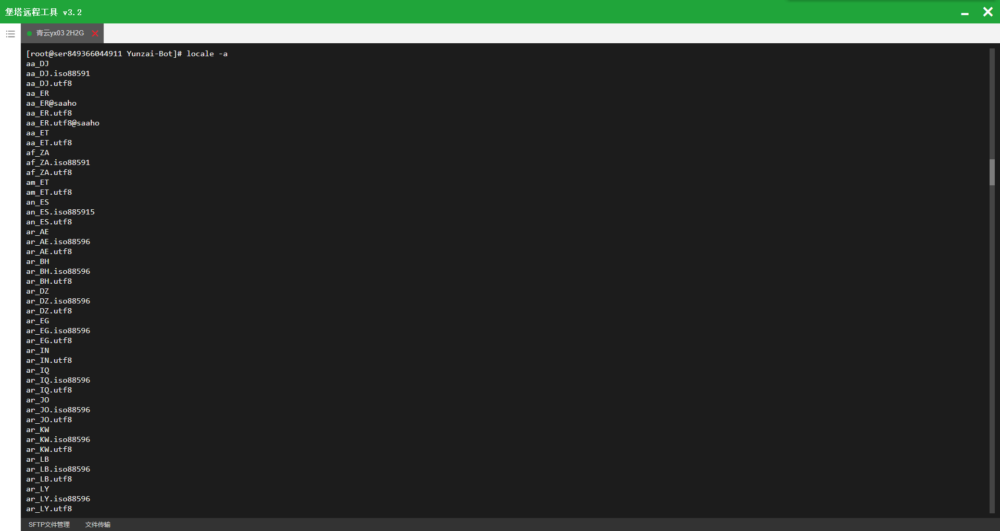

- 往下翻，找到zh_CN.utf-8

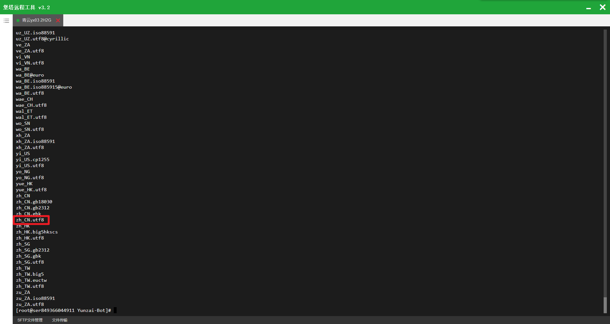

- 切换

```bash
localectl set-locale LANG=zh_CN.UTF-8
```

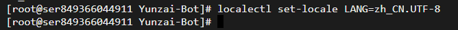

- 然后重启

- 启动Yunzai并按提示操作即可

```bash
node app
```

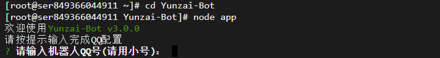

## 基础操作

- 启动云崽： `node app`

- 查看日志： `pnpm run log`

- 后台运行： `pnpm start`

- 关闭云崽： 对着机器人发送 `#关机`，或者在关掉云崽运行窗口

- 功能列表： `#帮助`,`#插件名称+帮助`

- 更新云崽： `#全部更新`,`#强制更新`，`#更新`,`git pull`

- 重置云崽的部分设置(QQ 号，主人 QQ 等)： `pnpm run login`

---

## 目录说明

| 目录                     | 说明                           |
| ------------------------ | ------------------------------ |
| config\config\qq.yaml    | 可以修改登录方式，QQ 号        |
| config\config\redis.yaml | redis的设置（非必要别修改）        |
| config\config\other.yaml | 可以修改主人 QQ                |
| data\face                | 存放添加表情的位置             |
| data\MysCookie           | 存放 cookie 的位置             |
| logs\                    | 存放日志文件的位置              |
| plugins\example          | 存放 js 插件的位置             |
| Yunzai-Bot\plugins       | 存放大型插件的位置，如喵喵插件 |

## ffmpeg安装教程

1. 先下载压缩包
- ffmpeg下载链接[☞ffmpeg][ffmpeg],密码114514

2. 下载完后解压,位置随便

3. 之后找到ffmpeg.exe和ffprobe.exe,复制文件路径

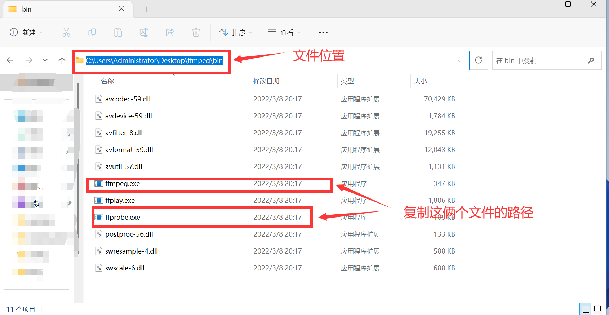

4. 填写路径,有两种方法。

**直接修改配置文件**

- 之后找到配置文件,如下图

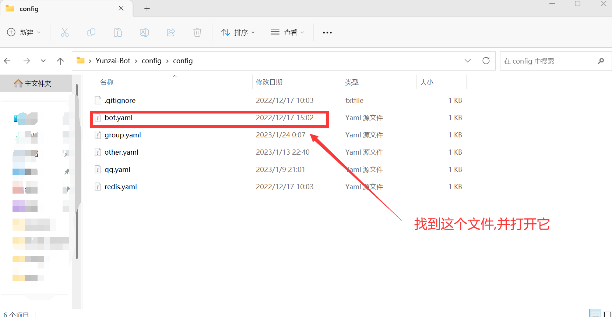

- 最后把路径粘贴到下图的位置(注意:冒号后面有空格)

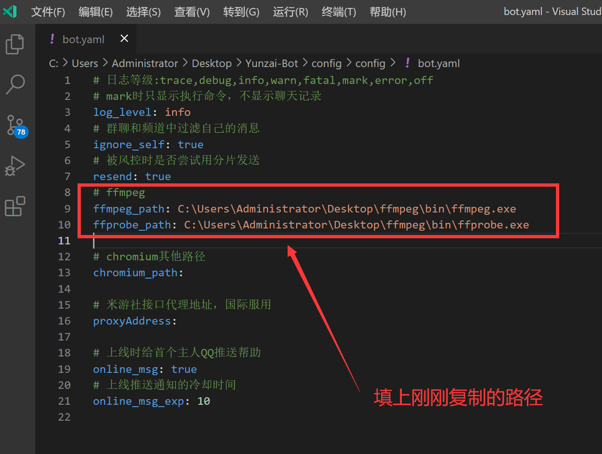

**锅巴里面设置**

1. 先登陆锅巴

2. 然后点配置管理-->基础配置

3. 把路径粘贴进去

4. 最后点保存

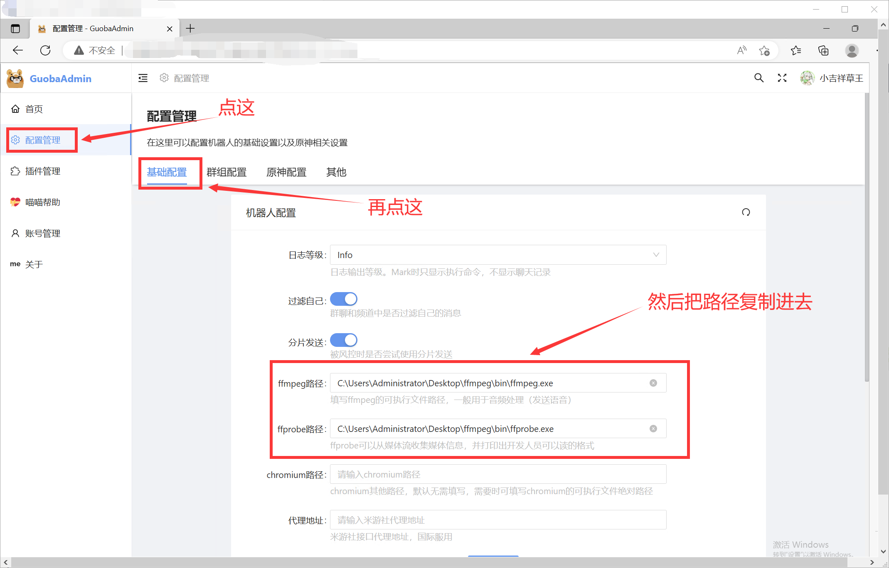

>注意事项:
>路径不能有空格，必须用单引号，必须用反斜杠。
>有些时候日志提示 `请检查ffmpeg配置` 可能是插件本身的问题，而不是你的 ffmpeg 没配置好

## 插件安装教程

- 注：均为V3插件

### [锅巴插件](https://gitee.com/guoba-yunzai/guoba-plugin) 

- 主要提供云崽的网页端后台管理界面功能
- 安装教程：
- 第 1 步：下载插件

- 在云崽根目录下打开终端，运行

```bash
git clone --depth=1 https://gitee.com/guoba-yunzai/guoba-plugin.git ./plugins/Guoba-Plugin/
```

- 第 2 步：安装依赖

> 注：如果你不是通过`pnpm`安装的云崽，那么请【**不要**】使用此方式，请看`方式2`

如果你是使用`pnpm`安装的云崽，那么只需要在云崽根目录下运行此命令即可：

```bash
pnpm install --filter=guoba-plugin
```

> 注：请务必直接复制提供的命令，否则可能会导致依赖丢失的情况，若发生需自行重新安装。<br>
> `--filter=guoba-plugin`：只安装`guoba-plugin`下的依赖，其他依赖不处理，防止丢失。

- 第 3 步：运行插件

依赖安装完毕之后，直接运行即可，默认运行端口号是：50831

> 可在 config/application.yaml 中修改

启动完成之后，可以在控制台中看到网页地址，复制到浏览器中即可访问。

如果访问不到，请发送`#锅巴帮助`指令获取帮助。

### [喵喵插件 (miao-plugin)](https://gitee.com/yoimiya-kokomi/miao-plugin)

- Miao-Plugin是一个Yunzai-Bot的升级插件，提供包括角色查询等升级功能。

- 具体功能可在安装插件后 通过 #喵喵帮助 进行查看。如需进行设置可通过 #喵喵设置 命令进行管理。

- 推荐使用git进行安装，以方便后续升级。在Yunzai根目录夹打开终端，运行

-  使用gitee

```bash
git clone https://gitee.com/yoimiya-kokomi/miao-plugin.git ./plugins/miao-plugin/
```

- 进行安装。建议使用上述命令进行安装，以便于后续更新。 管理员发送`#喵喵更新`即可自动更新

### [抽卡插件 (flower-plugin)](https://gitee.com/Nwflower/flower-plugin)

- flower-plugin是一个适用于V3版本Yunzai-Bot的原神图鉴插件包，主要提供拓展抽卡功能，意在不修改本体抽卡卡池信息的情况下提供自定义卡池的拓展

- 在Yunzai-Bot根目录下，运行cmd，输入以下指令

```bash
git clone --depth=1 https://gitee.com/Nwflower/flower-plugin.git ./plugins/flower-plugin/
```

### py插件

- 我个人的建议是：
- 别去费精力装了
- 直接装个nonebot吧
- 换个登录端口实现1号俩机器人

### [单个js格式插件通用安装方法](https://gitee.com/yhArcadia/Yunzai-Bot-plugins-index?_from=gitee_search#js%E6%8F%92%E4%BB%B6%E7%B4%A2%E5%BC%95)

- 超级简单，只要把插件下载好后放入 `Yunzai-bot/plugins/example` 里即可 
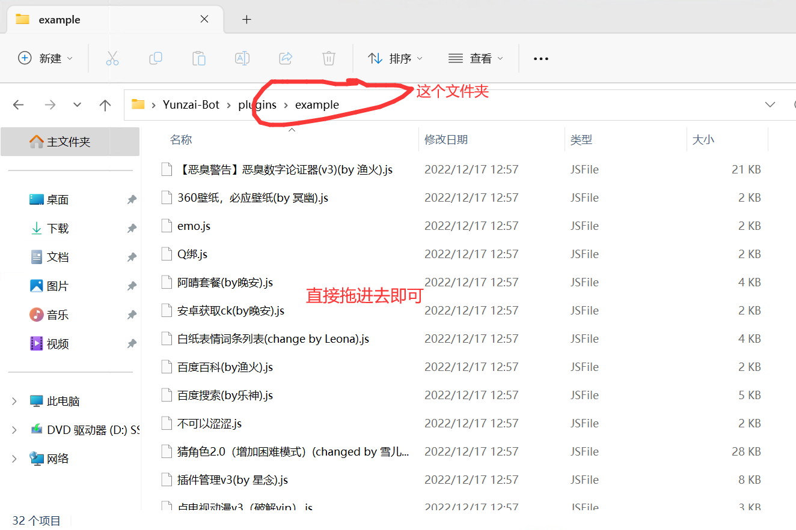


## 问题解答

- 遇到问题怎么办
  - 先不要急着问
  - 重启一下试试
  - 重装一下试试
  - 换台设备试试
  - 用这个试试https://baidu.com
  - 实在不行就别搞了
  - 把后台报错日志截图，并准备好充足的问题描述(态度要好)


  - 将后台报错日志截图和完整的问题描述发到群里。
  - 等待有人为你解答


- cookie 绑定失败？

  - 先把云崽 `#强制更新` 一下 
  - 然后重新获取cookie

- 装完 node 但是还是提示 `npm:command not found`

  - 没配置环境变量而已
  - 请自行百度搜索 `Windows环境变量设置`
  - 在用户环境变量的 Path 变量中点击编辑，添加 `C:\Program Files\nodejs` 与 `C:\Users\把这段中文替换成你自己的用户名\AppData\Roaming\npm` 字段
  - 重启电脑即可食用

- 签到显示 `验证码失败` ?

  - 问得好，好问题
  - 太正常不过，这个问题无解，有解决方法的请私发我
  - 至于什么时候会好嘛，我也不知道，你问大伟哥去

- 提示 `qq版本过低` ？

  -  <br>此图来源于喵喵插件群

  - 记得多试几次
  - 亲测有效

- 提示 `请配置公共ck` ？

  - 字面意思，`#配置公共ck`然后把你的ck发给机器人
  - 或者`#使用全部ck`

- 公共 ck 查询次数已用完，暂无法查询新 uid？

  - 不用慌，再绑定一个就是了
  - 或者 `#使用全部ck`

-  <br> MISCONF Redis is configured to save RDB snapshots

  - 控制面板->系统和安全->系统->高级系统设置->高级选项卡下方第一个卡片“性能”里的设置按钮->高级选项卡->虚拟内存->更改->勾选最上方自动管理所有驱动器的分页文件大小->重启电脑

- 机器人进群自动退了怎么办

  - 锅巴插件->配置管理->其它->退群人数改成 0 就行

- 如何删除插件?

  - 在 `Yunzai-bot/plugins` 文件夹里找到对应的插件右键删除即可，
  - 注：如果是插件包需要把整个文件夹都删掉

- 如何关闭入群欢迎?

  - 在 `Yunzai-bot/plugins/example` 文件夹里找到入群欢迎插件，右键删除，或者在锅巴插件中进行配置

- 机器人被冻结了，怎么办？

  - 号封了而已，没啥好办法，能解封就解不能解可以多备几个小号。关闭私聊，减少冻结频率。

- xx 功能报错，xx 功能异常？机器人打不开? 机器人坏了?
  - 重装吧兄弟
  - 也可以不重装：重置云崽步骤(数据会保留)：在云崽根目录下打开 git bash 输入`git pull`，然后再`git reset --hard origin/main`，最后再手动重启即可解决。

- 喵喵插件的 `#xx照片` `xx图片` 功能用不了？

 把 `Yunzai-Bot/plugins/miao-plugin/resources` 的 `character-img` 文件复制一份到 `Yunzai-Bot/plugins/miao-plugin/resources/miao-res-plus` 里就好了

- 机器人群聊消息发不出去，但是私聊正常？

  - 这是触发了 QQ 新版群聊风控，私聊机器人发送 <https://accounts.qq.com/safe/message/unlock?lock_info=5_5> 然后拿出你的手机，并登录机器人的手机 QQ，从机器人的手机 QQ 里打开个链接，验证就行了。

- 十连次数怎么修改？

  - [锅巴插件]里可以配置

- 服务器推荐？

  - 平时服务器都会比较贵，只有新用户和购物节会特别便宜，所以大家各凭本事吧，反正只要服务器能联网就能搭这个机器人。
  - 这里我推荐:[☞秋叶云][qiuyeyun]

- 插件除了这些还有别的吗
  - 更多的插件都在云崽官方群里，但是官方群它不对外开放...
  - 或者你可以学学自己写插件
  -不会？，那就看下面的教程吧


## 常用链接

>下载链接（均为网盘）有密码的均为114514

- redis下载链接:[☞redis][redis]
- git下载链接:[☞git][git]
- node.js下载链接:[☞node.js][nodejs]
- python3.8下载链接[☞python3.8][python]
- ffmpeg下载链接[☞ffmpeg][ffmpeg]
- 滑块验证助手下载链接[☞滑块验证][滑块验证]

>你一定用的上的地址

- 官方文档地址:[☞Yunzai-Bot][Yunzai-Bot]
- Yunzai-Bot插件库：[☞Github](https://gitee.com/yhArcadia/Yunzai-Bot-plugins-index)/[☞Gitee](https://gitee.com/yhArcadia/Yunzai-Bot-plugins-index)
- Yunzai-Bot（V3）：[☞Github](https://gitee.com/Le-niao/Yunzai-Bot)/[☞Gitee](https://gitee.com/Le-niao/Yunzai-Bot) 
- Yunzai-Bot（V2）：[☞Github](https://gitee.com/yoimiya-kokomi/Yunzai-Bot)/[☞Gitee](https://gitee.com/yoimiya-kokomi/Yunzai-Bot) 

## Yunzai-Bot插件教学

- 推荐使用vccode编写[☞下载][vccode]
 
### 单个的js插件

- [oicq][oicq]
- 先新建一个文件，命名为Helloworld.js
- <u>命名可以改的，最好别用中文，改命名时要记得把下面的类名改了(大小写得一样)</u>

#### 输出Hello，world！

- 代码示例

```javascript
//引入Yunzai插件功能
import plugin from '../../../../../lib/plugins/plugin.js'

//导出  类  类名===文件名 继承  插件类  
export class Helloworld extends plugin {
    constructor() {
        super({
            //后端信息
            name: 'Helloworld',//插件名字，可以随便写
            dsc: 'Helloworld',//插件介绍，可以随便写
            event: 'message',//这个直接复制即可，别乱改
            priority: 250,//执行优先级：数值越低越6
            rule: [
                {
                    //正则:也就是触发指令
                    reg: '^#你好$',
                    //函数:触发上面指令后调用的函数
                    fnc: 'Helloworld'
                }
            ]
        });
    };

    //函数
    async Helloworld(e) {
        e.reply("Hello, world!");//输出Hello，world！
        //阻止消息不再往下
        return;
    };
};
```

#### reply函数的多种用法

1. 直接发送内容：

```javascript
    //发送内容:
    e.reply("Hello, world!");
```

2. 是否引用回复：

```javascript
//是否引用回复:
e.reply("Hello, world!", true);//false为不引用，true为引用
```

3. 群聊是否撤回消息：

```javascript
//群聊是否撤回消息:
e.reply("Hello, world!", false, { recallMsg: 5 });//最大120秒后撤回，0则不处理
```

4. 是否at用户:

```javascript
//是否at用户:
e.reply("Hello, world!", false, { recallMsg: 0 }, true);//false为不at用户，true为at用户
```

#### 如何使用回复组件

- 代码示例

```javascript
//引入Yunzai插件功能
import plugin from '../../../../../lib/plugins/plugin.js'

//导出  类  类名:要与文件名一致 继承  插件类  
export class Helloworld extends plugin {
    constructor() {
        super({
            //后端信息
            name: 'Helloworld',//插件名字，可以随便写
            dsc: 'Helloworld',//插件介绍，可以随便写
            event: 'message',//这个直接复制即可，别乱改
            priority: 250,//执行优先级：数值越低越6
            rule: [
                {
                    //正则:也就是触发指令
                    reg: '^#你干嘛诶哟$',
                    //函数:触发上面指令后调用的函数
                    fnc: 'Helloworld'
                }
            ]
        });
    };

    //函数
    async Helloworld(e) {
        /** 设置上下文，后续接收到内容会执行hei方法 */
        this.setContext('hei');
        //发送消息
        e.reply("1+1=?");
    }

    //回复函数
    async hei(e) {
        //获取消息
        let xiaoxi = e.message;
        //判断消息
        if (xiaoxi == 3) {   //是
            //回复
            e.reply("回答正确")
            //结束上下文
            this.finish('hei')
        }
        else {               //否
            //回复
            e.reply("回答错误")
            //再次使用执行hei方法 
            this.setContext('hei')
        }
    }
};
```

#### 各式的判断

预计1月30号更新

### 交流群
|  群名  |      群号     |
|--------|--------------|
|[原神交流][qq]|773089934|

### 赞助

- 编写不易

- [欸嘿爱发电](https://afdian.net/a/20091124eihei)
- [qianxinwanjiu爱发电](https://afdian.net/a/qianxinwanjiu)


[Yunzai]: https://gitee.com/Le-niao/Yunzai-Bot
[Yunzai-Bot]: https://docs.yunzai.org/
[redis]: https://wwrl.lanzouw.com/iB1f70hizgxa
[git]: https://wwrl.lanzouw.com/iBjDY0hizgre
[nodejs]: http://nodejs.cn/download/
[vccode]: https://code.visualstudio.com/
[plugins]: https://gitee.com/yhArcadia/Yunzai-Bot-plugins-index
[python]: https://wwrl.lanzouw.com/iK7uS0ixl0fi
[ffmpeg]: https://wwrl.lanzouw.com/
[滑块验证]: https://maupdate.rainchan.win/txcaptcha.apk
[qiuyeyun]: https://qiuye.cloud/
[oicq]: https://github.com/takayama-lily/oicq
[qq]: https://qm.qq.com/cgi-bin/qm/qr?k=Cu1TnfTNNOdhx0lv17qbnTzp9lhOy_dJ&jump_from=webapi&authKey=8cmxRdVRamzJn0xPI2yet1a//X16faoVcTqD6P2vn/PIgJECkquiq8dyEoSgUJKt