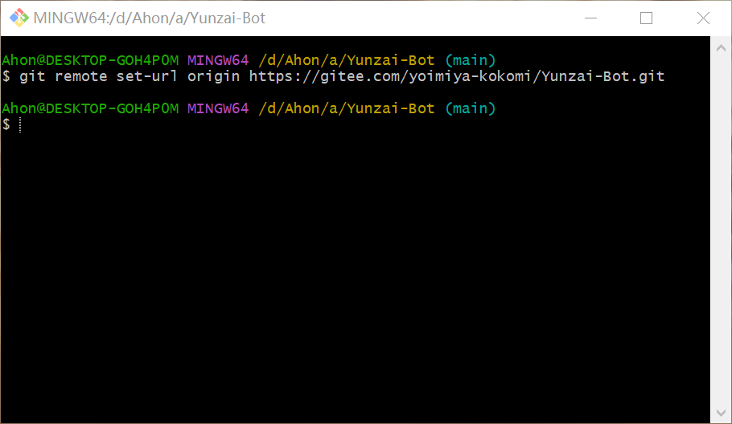
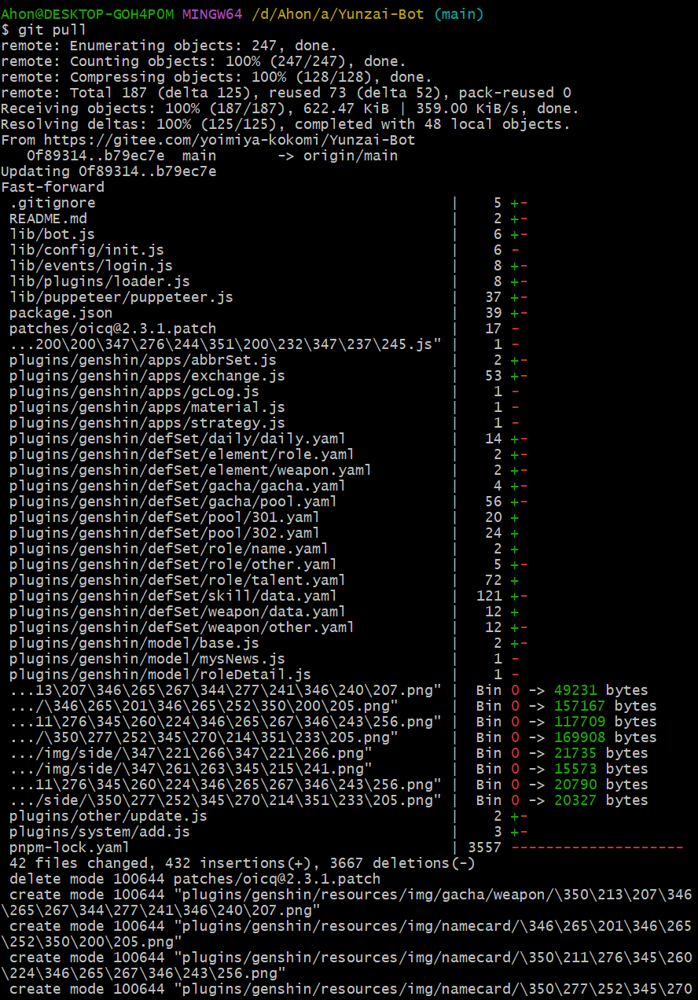
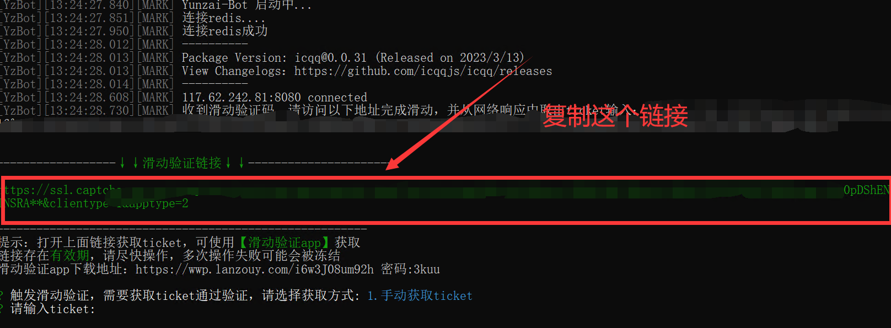
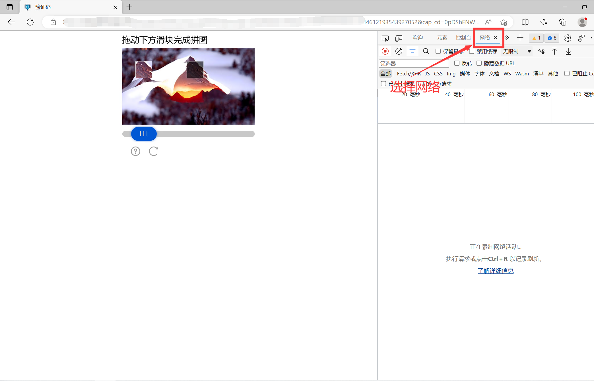
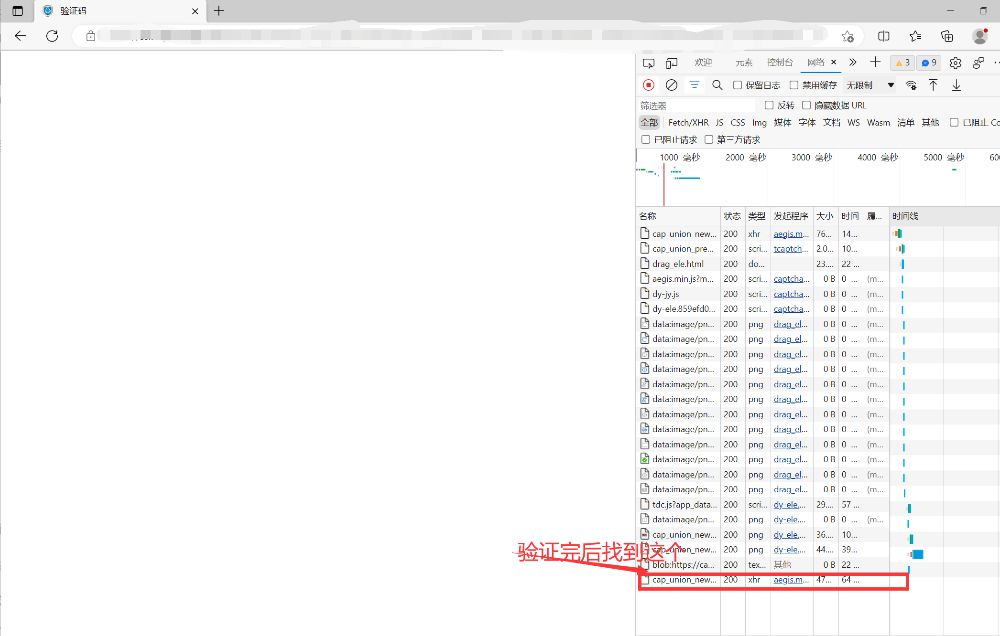
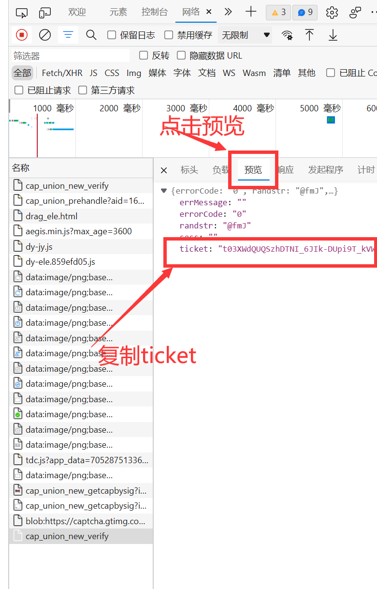

# Yunzai-Bot指南

## 简介

[]()
- Yunzai-Bot是原神qq群机器人,通过米游社接口,查询原神游戏信息,快速生成图片返回,
- 此指南是教你如何安装Yunzai-Bot和它的插件,编写插件和一些问题的解决方法。
- 本指南暂未完善,欢迎大家提交Issues和Pull Requests
- 我的博客:[qianxinwanjiu](https://qianxinwanjiu.com/eihei/)
- 我的仓库:[gitee](https://gitee.com/lin-zhi-xuan/eihei) ,[GitHub](https://github.com/LIN-ZX/Yunzai-Bot-)

## 目录


- [Yunzai-Bot的Windows安装教程](#windows)

  - [安装git](#%E5%AE%89%E8%A3%85git)
  - [安装redis](#%E5%AE%89%E8%A3%85redis)
  - [安装Yunzai-Bot本体](#%E5%AE%89%E8%A3%85yunzai-bot%E6%9C%AC%E4%BD%93)

- [Yunzai-Bot的Linux安装教程](#linux)

  - [Ubuntu20.04教程](Linux.md#ubuntu-2004%E6%95%99%E7%A8%8B)
  - [CentOS 7.9.2111](Linux.md#centos-792111%E6%95%99%E7%A8%8B)

- [TRSS脚本的安装教程](#%E5%AE%89%E8%A3%85trss%E8%84%9A%E6%9C%AC)

- [基础操作](#%E5%9F%BA%E7%A1%80%E6%93%8D%E4%BD%9C)

- [目录说明](#%E7%9B%AE%E5%BD%95%E8%AF%B4%E6%98%8E)

- [ffmpeg安装教程](#ffmpeg%E5%AE%89%E8%A3%85%E6%95%99%E7%A8%8B)

- [插件安装教程](#%E6%8F%92%E4%BB%B6%E5%AE%89%E8%A3%85%E6%95%99%E7%A8%8B)
 
  - [锅巴插件(Guoba-Plugin)](plugins.md#%E9%94%85%E5%B7%B4%E6%8F%92%E4%BB%B6)
  - [喵喵插件 (miao-plugin)](plugins.md#%E5%96%B5%E5%96%B5%E6%8F%92%E4%BB%B6-miao-plugin)
  - [抽卡插件 (flower-plugin)](plugins.md#%E6%8A%BD%E5%8D%A1%E6%8F%92%E4%BB%B6-flower-plugin)
  - [py插件](plugins.md#py插件)
  - [单个js格式插件通用安装方法](plugins.md#%E5%8D%95%E4%B8%AAjs%E6%A0%BC%E5%BC%8F%E6%8F%92%E4%BB%B6%E9%80%9A%E7%94%A8%E5%AE%89%E8%A3%85%E6%96%B9%E6%B3%95)

- [常用链接](#%E5%B8%B8%E7%94%A8%E9%93%BE%E6%8E%A5)

- [问题解答](#%E9%97%AE%E9%A2%98%E8%A7%A3%E7%AD%94)

- [Yunzai-Bot插件编写教学](#yunzai-bot%E6%8F%92%E4%BB%B6%E7%BC%96%E5%86%99%E6%95%99%E5%AD%A6)

## 安装Yunzai-Bot

### Windows:

- 学不会怎么办,V我50我手把手教你

- 环境准备:[Node.js](http://nodejs.cn/download/)(建议版本v16.18.0),[redis](https://wwrl.lanzouw.com/iB1f70hizgxa),[git](https://wwrl.lanzouw.com/iBjDY0hizgre)

####  安装git

- 下载地址[git](https://wwrl.lanzouw.com/iBjDY0hizgre),密码:114514


- 一直点next

#### 安装redis

- 下载地址[redis](https://wwrl.lanzouw.com/iB1f70hizgxa),密码:114514

- 解压后启动redis-server.exe这个文件。

- 要一直开着,不能关掉。


#### 安装Yunzai-Bot本体

1. 新建一个文件夹(也可以不建),命名随便,最好别用中文

2. 选个拉取方式:

**使用git-bash**

- 1.1 右键文件夹,选择git bash here


**使用原生自带终端**

- 2.1 进入你要安装Yunzai的文件夹

- 2.2 打开终端(在文件夹路径处将文件家路径改为cmd或者powershell)

3. 克隆项目

- 命令

```sh
git clone --depth=1 -b main https://gitee.com/yoimiya-kokomi/Yunzai-Bot.git
```


4. 进入Yunzai目录

```sh
cd Yunzai-Bot 
```


5. 安装pnpm,已安装的可以跳过

```sh
npm install pnpm -g
```

- （因为我已经安装过了,所以就不放图了）

- 这里会发生的一些问题：
    输完卡住不动了怎么办？或者提示 `npm ERR！`？或者其他的报错？
    原因：你的服务器网络太差了,根本下载不动,没问题才怪了。
    解决方案：换源,执行命令来更换淘宝镜像源 `npm config set registry http://registry.npm.taobao.org` 然后再次执行安装 pnpm 的命令 `npm install pnpm -g`  
    就是可能有点后遗症,更换镜像源后有微小概率导致后续安装出现问题

6. 安装依赖

```sh
pnpm install -P
```


7. 运行（首次运行按提示输入登录）

```sh
node app
```


- 如果觉得麻烦,可使用脚本：

>新建一个文件,把后缀改成bat,然后点击编辑

- 把下面代码复制进去,然后进行修改:

- 第一行中,第一个双引号无需填写,第二个双引号填写你redis路径
- 第二行填写你Yunzai-Bot根目录

```bat
start "" "C:/redis/redis-server.exe"
cd C:/Yunzai-Bot
node app
pause
```

- 改完后保存运行即可食用

### Linux

- 教程中的操作系统有(Ubuntu 20.04),(CentOS 7.9.2111)

- [Linux安装教程](./Linux.md)

### Yunzai-Bot换源方法

- 这种方法不会掉任何插件和任何数据,但是部分依赖可能会掉,安装完成之后登录yunzai,根据yunzai的提示,用`pnpm install -p`安装依赖就好了！！！

- 打开yunzai根目录,在空白处右击鼠标,**git bash here**,或使用**cmd**等

- 输入以下命令换**喵喵源**
```sh
git remote set-url origin https://gitee.com/yoimiya-kokomi/Yunzai-Bot.git
```



- 然后输入

```sh
git checkout main
```

- 拉取更新

```sh
git pull && git reset --hard origin/main
```



- 如果出现图中报错就需要删除**package.json**和**pnpm-lock.yaml**这两个文件然后再


```sh
git pull
```

- 如果没有请继续

- 安装相关依赖

```sh
pnpm install -P
```


- 之后删除原/data/QQ号文件夹,使用以下命令重新登录

```sh
pnpm run login
```


- 之后按照提示继续登录即可

## 安装TRSS脚本

### Windows平台:

<details><summary>MSYS2：Linux 兼容层（关闭 虚拟化 或 内存小于等于4G 推荐）</summary>

#### MSYS2 安装
- [MSYS2官网](https://msys2.org/)
- [MSYS2 安装程序](https://github.com/msys2/msys2-installer/releases/download/nightly-x86_64/msys2-x86_64-latest.exe)
_PS:若速度太慢，可使用 GitHub 加速，如：[GitHub Proxy](https://ghproxy.com/github.com/msys2/msys2-installer/releases/download/nightly-x86_64/msys2-x86_64-latest.exe)_

#### 安装脚本
_PS: 首次安装可能会自动关闭，再次启动即可_
_PS: 以下内容复制至[TRSS.me](https://trss.me/Install/MSYS2.html#msys2-%E5%AE%89%E8%A3%85)_
- 在`MSYS2`内执行:
```
bash <(curl -L gitee.com/TimeRainStarSky/TRSS_Yunzai/raw/main/Install-MSYS2.sh)
```
<details><summary>自定义功能</summary>

- 自定义 安装路径 `DIR` 和 启动命令 `CMD`（可用于多开）

- 举例：将脚本安装至 `/Bot` 启动命令 `trss`
```
# 原安装命令
bash <(curl -L gitee.com/TimeRainStarSky/TRSS_Yunzai/raw/main/Install-MSYS2.sh)
# 修改后安装命令
DIR=/Bot CMD=trss bash <(curl -L gitee.com/TimeRainStarSky/TRSS_Yunzai/raw/main/Install-MSYS2.sh)
```
</details>

</details>

<details><summary>ArchWSL：Linux 子系统（开启 虚拟化 且 内存大于等于8G 推荐）</summary>

**系统要求**
- Windows 11 及以上 / Windows Server 2022及以上 
- 升级为WSL2的要求: 对于x64的系统要求win10版本为1903 或者更高, 可使用 Win + R 输入`winver`查看版本

#### 安装ArchLinux
1. 右键开始菜单, 选择`终端(管理员)`并执行以下内容:
```
# 启用 适用于 Linux 的 Windows 子系统
dism /online /enable-feature /featurename:Microsoft-Windows-Subsystem-Linux /all /norestart
# 启用 虚拟机平台
dism /online /enable-feature /featurename:VirtualMachinePlatform /all /norestart
```
2. 重启设备后，启用 WSL2
```
wsl --set-default-version 2
```
**输出以下内容则表示 WSL2 启用成功**
```
有关与 WSL 2 的主要区别的信息，请访问 https://aka.ms/wsl2
操作成功完成。
```
3. 更新 WSL2 内核
```
wsl --update
```
_PS: 如果速度太慢,可手动下载更新包: [https://aka.ms/wsl2kernel](https://aka.ms/wsl2kernel)
4. 从[ArchWSL GitHub Releases Assets](https://github.com/yuk7/ArchWSL/releases/latest)中下载`Arch.zip`并解压
_PS: 如果速度太慢可使用Github加速,如: [Github Proxy](https://ghproxy.com/)_
5. 启动`Arch.exe`
_PS: 如果输出以下内容则表示ArchWSL安装成功_
```
Using: xxx\rootfs.tar.gz
Installing...
Installation complete
Press enter to continue...
```
6. 在`文件资源管理器`中打开(`Win + R`运行):
```
\\wsl$\Arch\etc\pacman.d
```
- 编辑`mirrorlist`,在`China`后选择你喜欢的镜像源,删除开头的`#`, 保存
```
\\wsl$\Arch\etc
```
- 编辑`pacman.conf`,在文件末尾添加以下内容并保存:
```
[archlinuxcn]
Server = https://mirrors.ustc.edu.cn/archlinuxcn/$arch
Server = https://mirrors.bfsu.edu.cn/archlinuxcn/$arch
Server = https://mirrors.tuna.tsinghua.edu.cn/archlinuxcn/$arch
Server = https://mirrors.aliyun.com/archlinuxcn/$arch
Server = https://mirrors.163.com/archlinux-cn/$arch
Server = https://mirrors.tencent.com/archlinuxcn/$arch
Server = https://repo.archlinuxcn.org/$arch
SigLevel = Never
[arch4edu]
Server = https://mirrors.bfsu.edu.cn/arch4edu/$arch
Server = https://mirrors.tuna.tsinghua.edu.cn/arch4edu/$arch
Server = https://mirrors.aliyun.com/arch4edu/$arch
Server = https://mirrors.tencent.com/arch4edu/$arch
SigLevel = Never
```
7. 启动`Arch.exe`
_PS: 如果输出以下内容则表示`ArchWSL`启动成功:
```
[root@xxx Arch]#
```
8. 更改软件包
```
pacman -Syy archlinux-keyring && pacman -Syu
```
- 启动：运行 Arch.exe 或终端输入 wsl
- 文件管理: 在`文件资源管理器`中打开(`Win + R`运行):
```
\\wsl$\Arch\root
```
- 卸载: `wsl --unregister Arch`

_PS: 其他功能请参阅 [Microsoft 官方文档](https://learn.microsoft.com/zh-cn/windows/wsl) 和 [ArchWSL 文档](https://github.com/yuk7/ArchWSL/blob/master/i18n/README_zh-cn.md)_

#### 安装脚本
_PS:以下内容复制至[TRSS.me](https://trss.me/Install/Arch_Linux.html)_

- 在ArchLinux里执行:
```
bash <(curl -L gitee.com/TimeRainStarSky/TRSS_Yunzai/raw/main/Install.sh)
```

<details><summary>自定义功能</summary>

- 自定义 安装路径 `DIR` 和 启动命令 `CMD`（可用于多开）

- 举例：将脚本安装至 `/Bot` 启动命令 `trss`
```
# 原安装命令
bash <(curl -L gitee.com/TimeRainStarSky/TRSS_Yunzai/raw/main/Install.sh)
# 修改后安装命令
DIR=/Bot CMD=trss bash <(curl -L gitee.com/TimeRainStarSky/TRSS_Yunzai/raw/main/Install.sh)
```

</details>

</details>

### Linux平台:

<details><summary>Docker：应用容器（推荐）</summary>

_PS:以下内容复制至[TRSS.me](https://trss.me/Install/Docker.html)_

#### 安装脚本
- 在Linux中执行:
```
bash <(curl -L gitee.com/TimeRainStarSky/TRSS_Yunzai/raw/main/Install-Docker.sh)
```

<details><summary>自定义功能</summary>

- 自定义 安装路径`DIR`启动命令`CMD`容器名`DKNAME`

- 举例：将脚本安装至 `/Bot` 启动命令 `trss` 容器名`TRSS`
```
# 原安装命令
bash <(curl -L gitee.com/TimeRainStarSky/TRSS_Yunzai/raw/main/Install-Docker.sh)
# 修改后安装命令
DIR=/Bot CMD=trss bash <(curl -L gitee.com/TimeRainStarSky/TRSS_Yunzai/raw/main/Install-Docker.sh)
```

</details>

<details><summary>容器管理</summary>

<details><summary>查看容器</summary>

```
docker ps -as
```
</details>

<details><summary>启动容器</summary>

```
docker start 容器名 # 默认开机自启，无需手动启动
```

</details>

<details><summary>重启容器</summary>

```
docker restart -t0 容器名
```

</details>

<details><summary>停止容器</summary>

```
docker stop -t0 容器名
```

</details>

<details><summary>删除容器</summary>

```
docker rm -f 容器名
```

</details>

<details><summary>重建容器</summary>

```
docker run -itd
  -h 主机名
  --name 容器名
  -v 数据路径:/root/项目名
  --restart always #自启动
  -p 主机端口:容器端口 #端口映射
  镜像名
```

</details>

- 服务器 Linux 发行版 推荐使用 `Debian 11` 以上
- 若只有 `Debian 10` 以下，可执行以下命令并重启服务器后升级到 `Debian 12`
```
echo 'deb http://ftp.cn.debian.org/debian bookworm main contrib non-free
deb http://ftp.cn.debian.org/debian bookworm-updates main contrib non-free
deb http://ftp.cn.debian.org/debian-security bookworm-security main contrib non-free'>/etc/apt/sources.list
apt update && apt full-upgrade -y && apt autoremove --purge -y && apt clean
```

</details>

</details>

## 基础操作

- 启动云崽： `node app`

- 查看日志： `pnpm run log`

- 后台运行： `pnpm start`

- 关闭云崽： 对着机器人发送 `#关机`,或者在关掉云崽运行窗口

- 功能列表： `#帮助`,`#插件名称+帮助`

- 更新云崽： `#全部更新`,`#强制更新`,`#更新`,`git pull`

- 重置云崽的部分设置(QQ 号,主人 QQ 等)： `pnpm run login`

## 目录说明

| 目录                     | 说明                           |
| ------------------------ | ------------------------------ |
| config\config\qq.yaml    | 可以修改登录方式,QQ 号        |
| config\config\redis.yaml | redis的设置（非必要别修改）        |
| config\config\other.yaml | 可以修改主人 QQ                |
| data\face                | 存放添加表情的位置             |
| data\MysCookie           | 存放 cookie 的位置             |
| logs\                    | 存放日志文件的位置              |
| plugins\example          | 存放 js 插件的位置             |
| Yunzai-Bot\plugins       | 存放大型插件的位置,如喵喵插件 |

## 如何在Windows获取ticket

- 浏览器:Edge

- 复制滑动验证链接,到浏览器打开



- 按**F12**打开控制台,选择**网络**



- 然后开始验证,验证完后找到下图圈的那个东西,单击



选择**预览**,复制**ticket**
**(注意:复制ticket时不要把两边的双引号复制进去)**




- 最后返回终端,粘贴刚刚复制的**ticket**,并回车


## ffmpeg安装教程

1. 先下载压缩包
- ffmpeg下载链接[☞ffmpeg](https://wwrl.lanzouw.com/iK7uS0ixl0fi),密码114514

2. 下载完后解压,位置随便

3. 之后找到ffmpeg.exe和ffprobe.exe,复制文件路径


4. 填写路径,有两种方法。

**直接修改配置文件**

- 找到配置文件,如下图


- 最后把路径粘贴到下图的位置(注意:冒号后面有空格)


- 冒号后面是有空格,一定要注意这一点。

**锅巴里面设置**

1. 先登陆锅巴

2. 然后点配置管理-->基础配置

3. 把路径粘贴进去

4. 最后点保存


>注意事项:
>路径不能有空格,必须用单引号,必须用反斜杠。
>有些时候日志提示 `请检查ffmpeg配置` 大概率是插件本身的问题,而不是你的 ffmpeg 没配置好

## 插件安装教程

- [插件安装教程](./plugins.md#%E6%8F%92%E4%BB%B6%E5%AE%89%E8%A3%85%E6%95%99%E7%A8%8B)

## 常用链接

>下载链接（均为网盘）有密码的均为114514

|名称|下载地址|
|---|---|
|redis|[☞redis](https://wwrl.lanzouw.com/iB1f70hizgxa)|
|git|[☞git](https://wwrl.lanzouw.com/iBjDY0hizgre)|
|node.js|[☞node.js](http://nodejs.cn/download/)|
|python3.8|[☞python3.8](https://wwrl.lanzouw.com/intnd0ixl4pc)|
|ffmpeg|[☞ffmpeg](https://wwrl.lanzouw.com/iK7uS0ixl0fi)|
|滑块验证助手|[☞滑块验证](https://maupdate.rainchan.win/txcaptcha.apk)|


- 官方文档地址:[☞Yunzai-Bot](https://docs.yunzai.org/)
- Yunzai-Bot插件库：[☞Github](https://gitee.com/yhArcadia/Yunzai-Bot-plugins-index)/[☞Gitee](https://gitee.com/yhArcadia/Yunzai-Bot-plugins-index)
- Yunzai-Bot（V3）：[☞Github](https://gitee.com/Le-niao/Yunzai-Bot)/[☞Gitee](https://gitee.com/Le-niao/Yunzai-Bot) 
- Yunzai-Bot（V2）：[☞Github](https://gitee.com/yoimiya-kokomi/Yunzai-Bot)/[☞Gitee](https://gitee.com/yoimiya-kokomi/Yunzai-Bot) 

## 问题解答

- [问题解答](./issue.md)

## Yunzai-Bot代搭

- [问题解答](./daida.md)

## Yunzai-Bot插件编写教学

- [Yunzai-Bot插件编写教学](plugins.md#yunzai-bot%E6%8F%92%E4%BB%B6%E7%BC%96%E5%86%99%E6%95%99%E5%AD%A6)

## 交流群

|群名|群主|
|----|----|
|[原神交流](https://qm.qq.com/cgi-bin/qm/qr?k=Cu1TnfTNNOdhx0lv17qbnTzp9lhOy_dJ&jump_from=webapi&authKey=8cmxRdVRamzJn0xPI2yet1a//X16faoVcTqD6P2vn/PIgJECkquiq8dyEoSgUJKt)|[@eihei](https://gitee.com/lin-zhi-xuan)|

## 赞助

- 编写不易

- [枫林爱发电](https://afdian.net/a/20091124eihei)
- [qianxinwanjiu爱发电](https://afdian.net/a/qianxinwanjiu)

## 开学通知

- 作者我已于2月6号开学,以后随缘更新,大概1周会有一次更新（没有跑路！没有跑路！没有跑路！）


